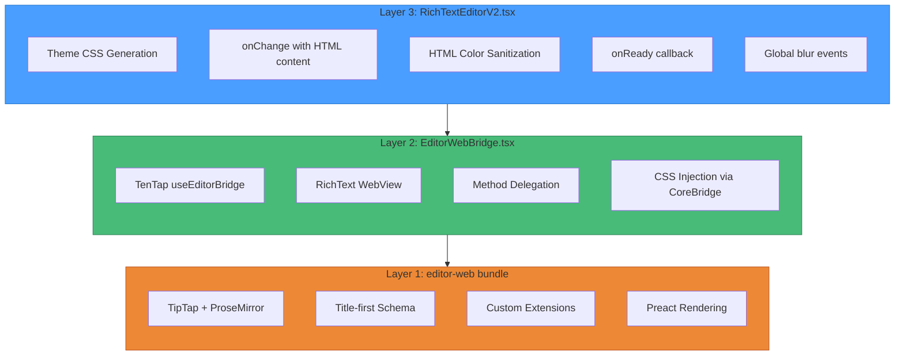
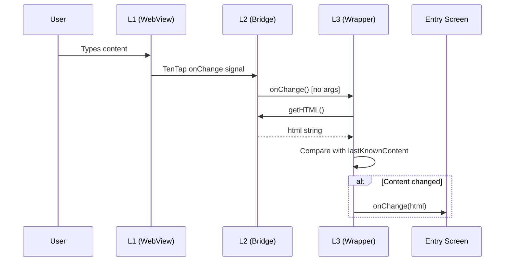

# Rich Text Editor Architecture

> **For AI Assistants**: This document is the single source of truth for the editor architecture.
> Before modifying any editor layer, read this document completely.

## Architecture Overview



## Layer Details

### Layer 1: Web Bundle (`editor-web/`)

**Purpose**: TipTap editor running inside a WebView with custom title-first schema.

**Key Files**:
- `index.tsx` - Entry point, TipTap configuration
- `index.html` - HTML template with base styles
- `extensions/Title.ts` - Title node extension
- `extensions/TitleDocument.ts` - Document schema requiring title first

**Build Command**: `npm run editor:build` (from apps/mobile)

**Output**: `editor-web/build/editorHtml.js` - Single HTML string export

**Key Concepts**:
- Uses **Preact** instead of React for smaller bundle (~530KB)
- Uses **MinimalBridgeKit** (not full TenTapStartKit) to reduce size
- Title-first schema: document = title + body blocks
- Custom `BodyPlaceholder` extension for placeholder in first paragraph

**DO NOT**:
- Add React (use Preact)
- Import full TenTapStartKit in web bundle
- Modify without rebuilding: `npm run editor:build`
- Ever think adding any kind of timer is a good idea

---

### Layer 2: Bridge (`EditorWebBridge.tsx`)

**Purpose**: Minimal TenTap wrapper exposing editor methods to React Native.

**Key Responsibilities**:
1. Initialize `useEditorBridge` with our custom editor bundle
2. Expose formatting methods via ref (toggleBold, toggleItalic, etc.)
3. Handle CSS injection when `customCSS` prop is provided
4. Apply `backgroundColor` to prevent white flash in dark mode

**Props**:
| Prop | Type | Description |
|------|------|-------------|
| `initialContent` | `string` | Initial HTML content |
| `onChange` | `() => void` | Signal callback (no args) |
| `customCSS` | `string?` | Theme CSS to inject |
| `backgroundColor` | `string?` | Native background color |

**Ref Methods**:
- Content: `setContent`, `getHTML`
- Focus: `focus`, `blur`
- Formatting: `toggleBold`, `toggleItalic`, `toggleUnderline`
- Lists: `toggleBulletList`, `toggleOrderedList`, `toggleTaskList`
- Indentation: `sink` (indent), `lift` (outdent)
- Headings: `toggleHeading(level)`
- History: `undo`, `redo`

**CSS Injection Pattern** (from v1):
```typescript
// When customCSS is provided:
const bridgesWithoutPlaceholder = TenTapStartKit.filter(bridge =>
  !bridge.name?.toLowerCase().includes('placeholder')
);
bridgeExtensions = [...bridgesWithoutPlaceholder, CoreBridge.configureCSS(customCSS)];
```

**DO NOT**:
- Add business logic (belongs in L3)
- Add theme awareness (L3 passes theme values as props)
- Modify onChange signature (L3 expects no args)
- Add state tracking (L2 is stateless bridge)

---

### Layer 3: Application Wrapper (`RichTextEditorV2.tsx`)

**Purpose**: Application-level wrapper adding theme support, dirty tracking hooks, and content management.

**Key Responsibilities**:
1. Generate theme-aware CSS from ThemeContext
2. Transform L2's signal-based onChange to content-based onChange
3. Sanitize HTML colors for theme consistency
4. Handle global blur events (swipe-back gesture)
5. Track ready state via onReady callback

**Props**:
| Prop | Type | Description |
|------|------|-------------|
| `onChange` | `(html: string) => void` | Content change callback |
| `editable` | `boolean` | Read-only mode |
| `onTapWhileReadOnly` | `() => void` | Tap in read-only callback |
| `onReady` | `() => void` | Editor ready callback |

**Ref Methods**: Same as L2 (delegates all calls)

**onChange Flow**:


**DO NOT**:
- Modify L2 behavior (use props to configure)
- Track dirty state (parent screen's responsibility)
- Fetch or save data (parent screen's responsibility)

---

## Data Flow

### Content Loading
```
Entry Screen → L3.setContent(html) → L2.setContent(html) → L1 WebView
```

### Content Retrieval
```
Entry Screen → L3.getHTML() → L2.getHTML() → L1 WebView → Promise<html>
```

### Theme Application
```
ThemeContext → L3 generates CSS → L2 customCSS prop → CoreBridge.configureCSS → L1 WebView
```

---

## Common Issues & Solutions

### Issue: Lists not working after CSS changes
**Cause**: Incorrect bridge filtering broke TenTapStartKit
**Solution**: Use v1 pattern - filter placeholder bridges, append CoreBridge.configureCSS at end

### Issue: White flash in dark mode
**Cause**: WebView default white background before CSS loads
**Solution**: Pass `backgroundColor` prop to L2, applied to native View and RichText

### Issue: onChange fires too often
**Cause**: L2 onChange is a signal, fires on every keystroke
**Solution**: L3 compares with `lastKnownContent`, only fires parent onChange when different

### Issue: Theme colors not applying
**Cause**: Inline styles in HTML override CSS
**Solution**: L3 sanitizes HTML colors via `sanitizeHtmlColors()` before setContent

---

## Debugging Guide

### L1 Issues (WebView/TipTap)
- Test with `EditorTestScreen` (Settings > Editor Test L1)
- Check Metro console for `[WebEditor]` logs
- Rebuild after changes: `npm run editor:build`

### L2 Issues (TenTap Bridge)
- Test with `TenTapTestScreen` (Settings > TenTap Test L2)
- Check Metro console for `[EditorWebBridge]` logs
- L2 should work without customCSS (test L2 directly)

### L3 Issues (Application Layer)
- Test with `RichTextEditorV2TestScreen` (Settings > RichTextEditor V2 L3)
- Check Metro console for `[RichTextEditorV2]` logs
- If L2 works but L3 doesn't, issue is in L3's wrapping logic

---

## Quick Reference

| Layer | File | Test Screen | Logs Prefix |
|-------|------|-------------|-------------|
| L1 | `editor-web/index.tsx` | Editor Test (L1) | `[WebEditor]` |
| L2 | `EditorWebBridge.tsx` | TenTap Test (L2) | `[EditorWebBridge]` |
| L3 | `RichTextEditorV2.tsx` | RichTextEditor V2 (L3) | `[RichTextEditorV2]` |

---

## For AI: Modification Checklist

Before modifying the editor:

1. [ ] Read this entire document
2. [ ] Identify which layer needs changes
3. [ ] Check if lower layers need modification (prefer configuring via props)
4. [ ] Test the layer in isolation using its test screen
5. [ ] If modifying L1: run `npm run editor:build`
6. [ ] Verify all three test screens still work after changes
