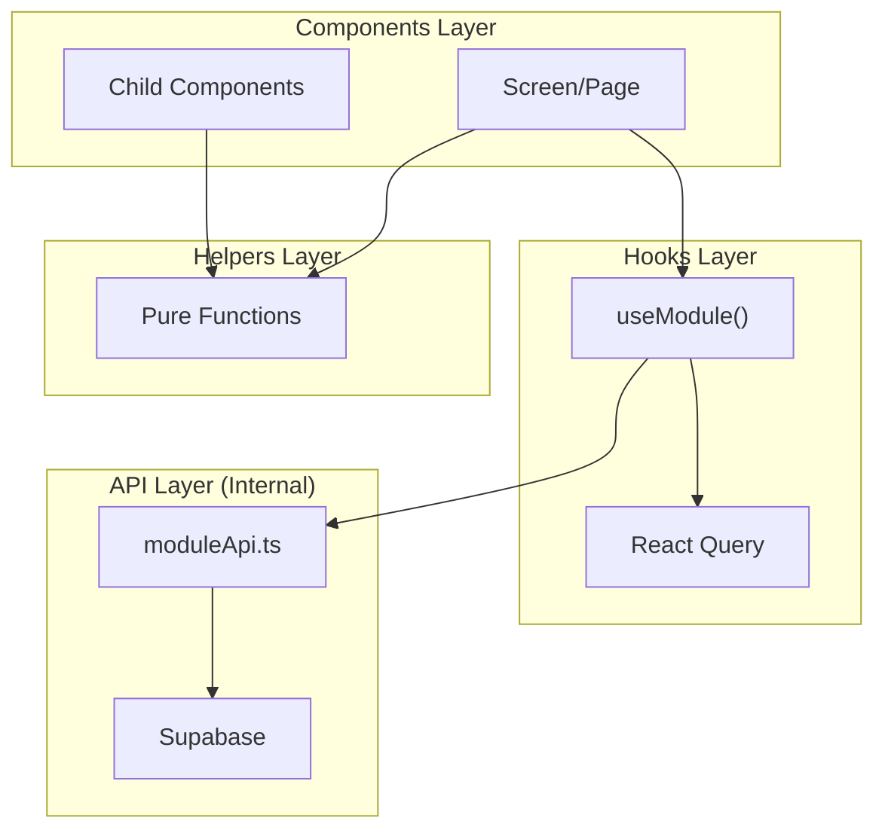
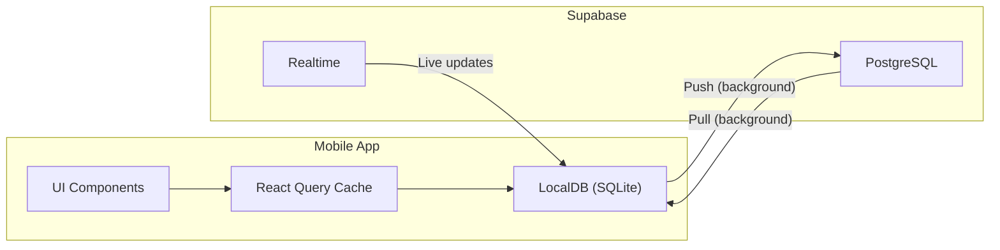

# Architecture Decisions

Hard architectural decisions made for the Trace project. Verified against codebase January 2026.

---

## 1. Tech Stack

### Shared (@trace/core)
- **TypeScript 5.9** - Type safety across entire codebase
- **Supabase JS SDK 2.58** - Backend client
- **TanStack React Query 5.62** - Data fetching, caching, mutations (peer dependency)
- **Vitest 4.x** - Unit testing for helper functions

### Mobile (@trace/mobile)
- **React Native 0.81.5** with **Expo SDK 54**
- **React 19.1.0** - New architecture enabled (`newArchEnabled: true`)
- **expo-sqlite 16.x** - Local database (SQLite)
- **react-native-maps 1.26.20** - Google Maps integration
- **@10play/tentap-editor 1.0.1** - Rich text editor (TipTap/ProseMirror WebView)
- **@tiptap/* 2.27.1** - TipTap extensions (v2 series, not v3)
- **expo-location 19.x** - GPS capture
- **expo-font + @expo-google-fonts** - Custom typography (17 font families)
- **React Native StyleSheet** - No CSS-in-JS libraries
- **Custom navigation** - No React Navigation (simpler, more control)

### Web (@trace/web)
- **React 19.1** with **Vite 7.1**
- **@tiptap/* 3.10.x** - TipTap v3 (different from mobile v2)
- **Tailwind CSS 3.4** - Utility-first styling
- **class-variance-authority 0.7** + **clsx** + **tailwind-merge** - Component variants
- **react-router-dom 7.9** - Routing

---

## 2. Database & Backend

### Supabase Configuration
- **Project ID:** `lsszorssvkavegobmqic`
- **Region:** us-east-2
- **PostgreSQL** - Primary database
- **Supabase Auth** - Email/password + Google OAuth
- **Supabase Storage** - Buckets: `attachments`, `avatars`
- **Supabase Realtime** - Enabled on all tables

### Schema Decisions
- **Soft deletes** - `deleted_at` timestamp, never hard delete
- **Version tracking** - `version` field auto-incremented via database trigger
- **Conflict resolution** - `base_version`, `conflict_status`, `conflict_backup` fields
- **Location hierarchy** - Address components stored directly on entries (city, neighborhood, region, subdivision, postal_code, country)
- **Dual coordinate system** - GPS coords (`entry_latitude/longitude`) + saved location reference (`location_id`)

### Tables (8 total)
| Table | Purpose | Key Fields |
|-------|---------|------------|
| `entries` | Core content | entry_id, stream_id, location_id, content, entry_date, is_archived |
| `streams` | Categories/collections | stream_id, name, entry_* config fields |
| `locations` | Saved location presets | location_id, name, latitude, longitude, source |
| `attachments` | Photos/files | attachment_id, entry_id, file_path, position |
| `profiles` | User profiles | id, username, name, avatar_url |
| `app_config` | App-wide settings | key, value (JSON) |
| `app_sessions` | Device tracking | user_id, platform, app_version, device_model |

---

## 3. External APIs

### Location & Maps
| API | Purpose | Why Chosen |
|-----|---------|------------|
| **Mapbox Geocoding** | GPS to address + hierarchy | 100k free/month, returns city/neighborhood/region |
| **Foursquare Places** | POI discovery & search | 100k free/day, best POI data quality |
| **Google Maps (react-native-maps)** | Map display | Free (client-side), Expo compatible |

### API Key Architecture
```
Mobile: Client-side keys via Expo env vars (EXPO_PUBLIC_*)
        |
        v
      @trace/core configureCore() receives keys at startup
        |
        v
      API modules use getFoursquareConfig() / getMapboxConfig()

Web:    Edge Function proxy for Foursquare (keeps key server-side)
```

---

## 4. Architecture Patterns

### Four-Layer Architecture



### Layer Rules
1. **API Layer** (`{module}Api.ts`) - Database operations, **NOT exported**
2. **Hooks Layer** (`{module}Hooks.ts`) - React Query wrappers, single unified export
3. **Helpers Layer** (`{module}Helpers.ts`) - Pure functions, **import directly**
4. **Components** - Screens consume hooks, children receive props

### File Naming Convention
```
packages/core/src/modules/{domain}/
  {domain}Api.ts         # camelCase - database operations
  {domain}Hooks.ts       # camelCase - React Query hooks
  {Domain}Types.ts       # PascalCase - TypeScript types
  {domain}Helpers.ts     # camelCase - pure utility functions
  index.ts               # public exports (NO api exports)
```

### Module Exports Pattern (index.ts)
```typescript
// Export hooks (single source of truth)
export { useEntries, useEntry } from "./entryHooks";
// Export types
export * from "./EntryTypes";
// Export helpers (import directly where needed)
export * from "./entryHelpers";
// DO NOT export API functions
```

---

## 5. Data & Sync

### Sync Architecture (Mobile)



### Offline-First Rules
- **LocalDB (SQLite)** is source of truth on mobile
- All reads/writes go through LocalDB first
- Supabase sync happens in background
- UI never waits for network

### Sync Order & Tracking
```
Push: Streams -> Locations -> Entries -> Attachments
Pull: Streams -> Locations -> Entries -> Attachments

Tracking: sync_action field on each entity
  - null: synced
  - 'create': pending insert
  - 'update': pending update
  - 'delete': pending soft delete
```

### Conflict Resolution
- **Strategy:** Last write wins + notification
- **Detection:** `base_version` compared against server `version`
- **Backup:** `conflict_backup` stores conflicting server version
- **Status:** `conflict_status` tracks resolution state

### Web App
- Direct Supabase calls (no LocalDB)
- No offline support

---

## 6. Configuration System

### Core Configuration Injection
```typescript
// At app startup (mobile: App.tsx, web: main.tsx)
import { configureCore } from '@trace/core';

configureCore({
  supabase: {
    url: process.env.EXPO_PUBLIC_SUPABASE_URL,
    anonKey: process.env.EXPO_PUBLIC_SUPABASE_ANON_KEY,
  },
  mapbox: {
    accessToken: process.env.EXPO_PUBLIC_MAPBOX_ACCESS_TOKEN,
  },
  foursquare: {
    apiKey: process.env.EXPO_PUBLIC_FOURSQUARE_API_KEY,
  },
  foursquareProxyUrl: process.env.FOURSQUARE_PROXY_URL, // web only
});
```

### Environment Variables
| Platform | Source | Prefix |
|----------|--------|--------|
| Mobile | `app.config.js` extra | `EXPO_PUBLIC_*` |
| Web | `.env` | `VITE_*` |
| Edge Functions | Supabase secrets | None |

---

## 7. Mobile-Specific Decisions

### Expo Configuration
- **Dev builds** - `com.trace.app.dev` suffix for side-by-side install
- **New Architecture** - Enabled via `newArchEnabled: true`
- **Custom plugins:**
  - `withNetworkSecurityConfig` - Cleartext for Metro bundler
  - `withMonorepoRoot` - Fixes Metro resolution in monorepo

### Maps
- **react-native-maps** - Google Maps provider
- **No clustering library** - Not currently implemented
- **Mapbox** - HTTP API only (no native SDK, avoids native dependencies)

### Rich Text Editor
- **@10play/tentap-editor** - TipTap v2 based
- **Local file:// images blocked** on Android 11+ (WebView security)
- **Solution:** Photo placeholders in editor, full display in gallery view

### Theme System
- 8 built-in themes: light, dark, sepia, techGreen, modern, highContrast, synthwaveDark, synthwaveLight
- `useTheme()` hook for dynamic theming
- Shared base values (spacing, typography, borderRadius) across all themes

### Storage
- **expo-file-system** - Local photo storage
- **expo-sqlite** - Local database with migrations
- **AsyncStorage** - User preferences only

---

## 8. Web-Specific Decisions

### Styling
- **Tailwind CSS** - No CSS modules or styled-components
- **CVA pattern** - Component variant management
- **No UI component library** - Custom components

### Build
- **Vite 7** - Fast dev server and builds
- **No SSR** - Client-side SPA only
- **TipTap v3** - Different version than mobile (intentional, better web support)

---

## 9. Edge Functions

### places-proxy
- **Purpose:** Keep Foursquare API key server-side for web
- **Auth:** Requires valid Supabase JWT
- **Whitelisted endpoints:** `/v3/places/search`, `/v3/autocomplete`
- **Mobile:** Can bypass proxy (client key acceptable)

```typescript
// Request format
GET /places-proxy?endpoint=/v3/places/search&ll=40.7,-74.0&radius=1000
Authorization: Bearer <supabase_jwt>
```

---

## 10. Code Organization

### Mobile Module Pattern
```
apps/mobile/src/modules/{domain}/
  mobileXxxApi.ts       # LocalDB operations
  mobileXxxHooks.ts     # Mobile-specific hooks (uses LocalDB)
  components/           # Domain-specific components
    screens/            # Full-screen views
    pickers/            # Input components
    hooks/              # Component-level hooks
```

### Component Limits
| Metric | Limit |
|--------|-------|
| Lines of code | ~300 max |
| useState/useRef | ~10 max |
| Total hooks | ~15 max |
| Props | ~8 max |

---

## 11. Rejected Alternatives

| Decision | Alternative | Why Rejected |
|----------|-------------|--------------|
| SQLite (mobile) | WatermelonDB, Realm | Simpler, Expo native support |
| TenTap editor | expo-rte, Pell, Quill | Best features, others lack image support |
| Mapbox (geocoding) | Google Geocoding | 10x more free requests |
| Foursquare (POI) | Google Places | 10x more free requests |
| Custom navigation | React Navigation | Simpler, more control, smaller bundle |
| StyleSheet (mobile) | CSS-in-JS | Native performance, no runtime overhead |
| TipTap v2 (mobile) | TipTap v3 | @10play/tentap-editor built on v2 |

---

## 12. Testing Strategy

- **Core package:** Vitest unit tests for helpers (`*.test.ts` files)
- **Mobile:** Type-check only (no unit tests)
- **CI Pipeline:** `npm run test:run` + `npm run type-check:mobile`

### Test File Locations
```
packages/core/src/modules/entries/entryHelpers.test.ts
packages/core/src/modules/streams/streamHelpers.test.ts
packages/core/src/modules/streams/templateHelpers.test.ts
packages/core/src/modules/locations/locationHelpers.test.ts
packages/core/src/modules/attachments/attachmentHelpers.test.ts
packages/core/src/modules/auth/authHelpers.test.ts
packages/core/src/modules/profile/profileHelpers.test.ts
packages/core/src/modules/settings/settingsHelpers.test.ts
```

---

## 13. Cost Projections

| Users | Mapbox | Foursquare | Supabase | Monthly Cost |
|-------|--------|------------|----------|--------------|
| 1,000 | Free | Free | Free tier | $0 |
| 5,000 | ~$75 | Free | Free tier | ~$75 |
| 10,000 | ~$200 | Free | $25+ | ~$225 |

**Mitigation:** Aggressive caching reduces API costs 60-80%.

---

*Last Verified: January 2026*
