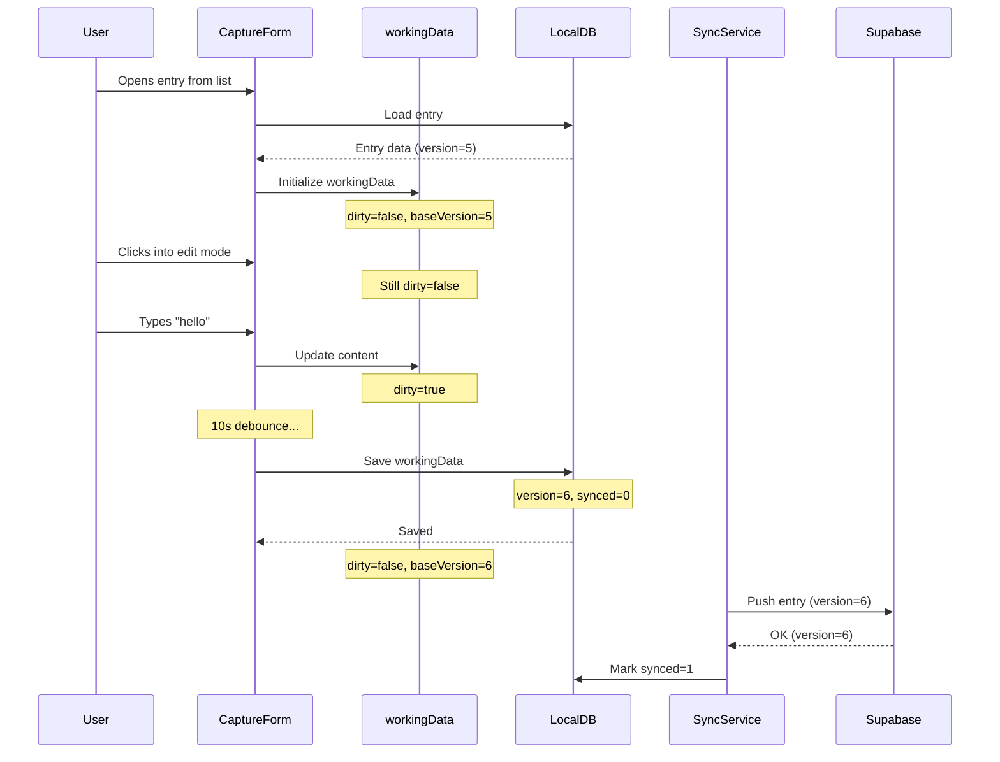
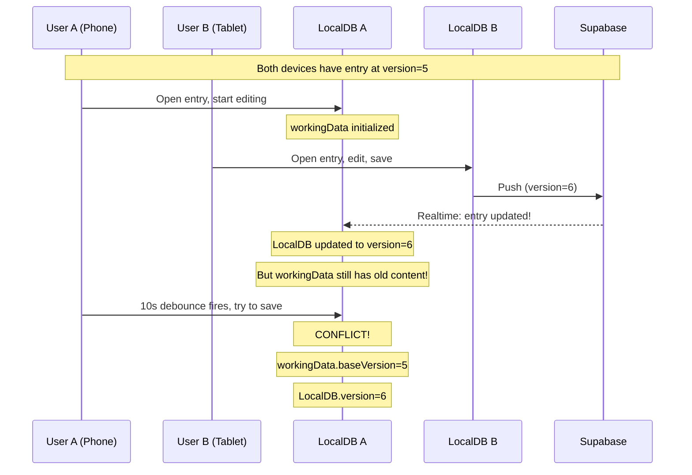
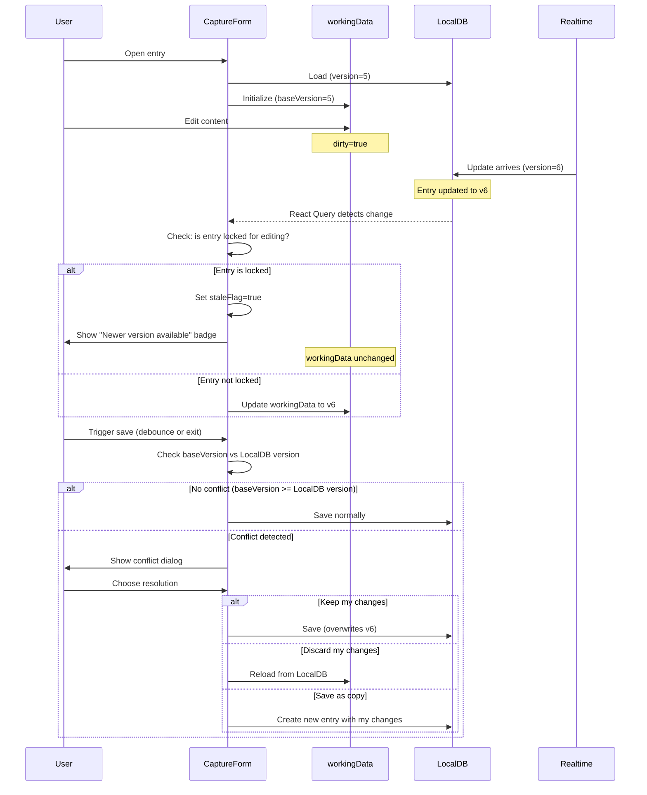
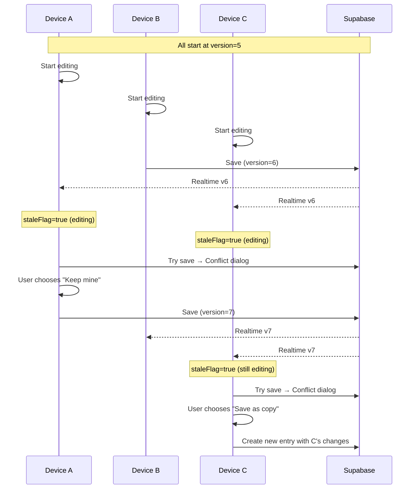

# Entry Editing Data Flow Analysis

## Current Architecture

```
┌─────────────┐     realtime      ┌─────────────┐
│  Supabase   │ ───subscription──▶│  LocalDB    │
│  (Cloud)    │                   │  (SQLite)   │
└─────────────┘                   └─────────────┘
       ▲                                 │
       │                                 │
   sync push                        React Query
       │                                 │
       │                                 ▼
       │                          ┌─────────────┐
       └──────────────────────────│  CaptureForm│
                                  │  (UI)       │
                                  └─────────────┘
```

**Key insight**: LocalDB is updated by realtime subscription. This is the ONLY path for cloud → local updates.

## Normal Editing Flow (No Conflicts)



## Conflict Scenario: Remote Update During Editing



## The Core Problem

When autosave triggers:
1. `workingData` has user's edits based on version=5
2. `LocalDB` now has version=6 from realtime sync
3. If we save workingData → we lose User B's changes
4. If we don't save → we lose User A's changes

## Option Analysis

### Option 1: Last Writer Wins (Current Broken Behavior)
- Simple but loses data
- ❌ Not acceptable

### Option 2: Block LocalDB Updates While Editing
- Don't apply realtime updates to entries being edited
- Pro: Simple, user's work is never disrupted
- Con: User A won't see User B's changes until they close and reopen
- Con: When User A saves, they'll overwrite User B's work

### Option 3: Merge on Save (Complex)
- Detect conflict on save
- Attempt automatic merge (content concatenation, field-level merge)
- Pro: Both changes preserved
- Con: Complex, merge could produce garbage
- Con: What if both edited the same paragraph?

### Option 4: Fork on Conflict
- When conflict detected on save, create a copy
- Original entry gets User B's version (from cloud)
- New "conflict copy" entry gets User A's version
- Pro: No data loss
- Con: User has to manually reconcile later
- Con: Multiple devices could create many forks

### Option 5: Warn and Let User Choose (Recommended)
- When realtime update arrives for entry being edited:
  - Show indicator: "This entry was updated by another device"
  - Continue letting user edit (don't disrupt)
- When user tries to save (or autosave triggers):
  - If conflict detected, show dialog:
    - "Keep my changes" (overwrites remote)
    - "Discard my changes" (loads remote version)
    - "Save as copy" (creates new entry with user's changes)

## Proposed Simplified Flow



## Three Device Scenario



## Key Decisions Needed

1. **When does "locked for editing" start?**
   - Option A: When entry form opens (view mode)
   - Option B: When user enters edit mode
   - Option C: When user makes first change (dirty=true)

2. **What triggers conflict check?**
   - Every autosave (2s/10s debounce)
   - Only on form close
   - Both

3. **Should we show the conflict dialog during autosave?**
   - Could be annoying if user is actively typing
   - Maybe only show on exit/manual save?

4. **What about the "stale" indicator?**
   - Just a badge? Or more prominent?
   - Should user be able to "refresh" to see remote changes?

## Recommended Implementation

1. **Simplify**: Remove all the complex race condition handling
2. **Lock early**: Lock entry when form opens (even in view mode)
3. **Stale flag**: When realtime update arrives for locked entry, set flag but don't update workingData
4. **Conflict on save**: Check LocalDB version vs baseVersion before saving
5. **User decides**: Show dialog only when user tries to close/navigate away with unsaved changes AND there's a conflict
6. **Don't auto-merge**: Too complex, let user decide

## Data Model Changes

No schema changes needed. We already have:
- `version` - incremented on each save
- `base_version` - version we started editing from
- `synced` - 0=unsynced, 1=synced

The conflict is detected by comparing:
```typescript
const hasConflict = localDB.entry.version > workingData.baseVersion;
```
