# Entry Screen Architecture

This document describes the architecture of the EntryScreen system - the screen used for creating and editing journal entries.

## Table of Contents

1. [Overview](#overview)
2. [The Problem It Solves](#the-problem-it-solves)
3. [High-Level Architecture](#high-level-architecture)
4. [Component Hierarchy](#component-hierarchy)
5. [EntryFormContext Deep Dive](#entryformcontext-deep-dive)
6. [Hooks](#hooks)
7. [Data Flow](#data-flow)
8. [Singleton Pattern](#singleton-pattern)
9. [File Reference](#file-reference)

---

## Overview

The EntryScreen is a **persistent, singleton screen** that handles both creating new entries and editing existing ones. It uses a centralized context (`EntryFormContext`) to manage all state, eliminating prop drilling across ~15 components and hooks.


---

## The Problem It Solves

### Before: Prop Drilling Hell

Without the context, the EntryScreen would need to pass 50+ parameters between components:

```
EntryScreen
├── props: entryId, isEditing, formData, updateField, handleSave...
├── MetadataBar (needs: formData, updateField, stream, visibility...)
├── RichTextEditor (needs: content, onChange, editable...)
├── PhotoGallery (needs: entryId, photoCount, onDelete...)
├── EntryPickers (needs: formData, updateField, streams, activePicker...)
└── ...each child needs different subsets of the same state
```

### After: Context-Based

```
EntryScreen
├── EntryFormProvider (holds ALL state)
└── EntryScreenContent
    ├── useEntryForm() → gets what it needs
    ├── MetadataBar → useEntryForm()
    ├── RichTextEditor → useEntryForm()
    ├── PhotoGallery → useEntryForm()
    └── EntryPickers → useEntryForm()
```

---

## High-Level Architecture


---

## Component Hierarchy

### EntryScreen.tsx (~900 lines)

The main screen component, split into two parts:


### UI Component Tree


---

## EntryFormContext Deep Dive

The context (~1200 lines) manages ALL state for entry editing. Here's what it contains:

### State Categories


### Key Functions

| Function | Purpose |
|----------|---------|
| `setEntry(id, options)` | Initialize screen for editing (id) or creating (null + options) |
| `clearEntry()` | Reset all state when leaving screen |
| `onEntryLoaded(entry)` | Populate form when entry data arrives from React Query |
| `updateField(field, value)` | Update a single form field |
| `updateMultipleFields(updates)` | Update multiple fields at once |
| `setBaseline(data)` | Set comparison point for dirty tracking |
| `markClean()` | Mark form as saved (not dirty) |
| `enterEditMode()` | Switch from view mode to edit mode |
| `addPendingPhoto(photo)` | Add photo to new entry (before first save) |
| `removePendingPhoto(id)` | Remove pending photo |
| `showSnackbar(msg)` | Show toast message |

### Type Definitions

```typescript
interface CaptureFormData {
  title: string;
  content: string;
  streamId: string | null;
  streamName: string | null;
  status: EntryStatus;
  type: string | null;
  dueDate: string | null;
  rating: number;
  priority: number;
  entryDate: string;
  includeTime: boolean;
  locationData: LocationType | null;
  geocodeStatus: GeocodeStatus;
  pendingPhotos: PendingPhoto[];
}

interface PendingPhoto {
  photoId: string;
  localPath: string;
  filePath: string;
  mimeType: string;
  fileSize: number;
  width: number;
  height: number;
  position: number;
}
```

---

## Hooks

Each hook handles a specific concern, all accessing state via `useEntryForm()`:

### useAutosave


**Purpose:** Automatically saves after user stops typing (2s) or after 30s max continuous typing.

### useEntryNavigation


**Purpose:** Handles back navigation with auto-save. Discards empty new entries, saves dirty entries.

### useGpsCapture


**Purpose:** Auto-captures GPS for new entries. Respects user settings and stream configuration.

### useAutoGeocode


**Purpose:** Automatically fills in city/region/country after GPS capture. First tries to snap to saved locations.

### useEntryPhotos

**Purpose:** Handles photo selection, compression, storage, and deletion. For new entries, photos are stored as "pending" until first save.

### useKeyboardHeight

**Purpose:** Tracks keyboard height for proper layout adjustment of the toolbar.

---

## Data Flow

### Creating a New Entry


### Editing an Existing Entry


### Leaving the Screen


---

## Singleton Pattern

### Why Singleton?

The EntryScreen uses a **persistent singleton pattern** to avoid TenTap editor memory leaks:

```mermaid
flowchart LR
    subgraph "Traditional Pattern"
        N1[Navigate to entry] --> M1[Mount screen + editor]
        M1 --> E1[Edit]
        E1 --> B1[Back]
        B1 --> U1[Unmount screen + editor]
        U1 --> N2[Navigate again]
        N2 --> M2[Mount NEW editor<br/>💥 Memory leak!]
    end
```




### How It Works

1. **EntryScreen mounts once** at app start
2. **Navigation calls `setEntry(id)`** instead of passing props
3. **Content is swapped** via `editorRef.current.setContent()`
4. **On leave, `clearEntry()`** resets state but doesn't unmount
5. **Editor instance persists** - no memory leaks

---

## File Reference

### Core Files

| File | Lines | Purpose |
|------|-------|---------|
| `EntryScreen.tsx` | ~900 | Main screen component |
| `context/EntryFormContext.tsx` | ~1200 | Centralized state management |
| `EntryScreen.styles.ts` | ~100 | StyleSheet definitions |

### Hooks

| File | Lines | Purpose |
|------|-------|---------|
| `hooks/useAutosave.ts` | ~150 | Debounced autosave with max wait |
| `hooks/useEntryNavigation.ts` | ~170 | Back navigation with auto-save |
| `hooks/useGpsCapture.ts` | ~260 | GPS capture for new entries |
| `hooks/useAutoGeocode.ts` | ~320 | Location snapping + reverse geocode |
| `hooks/useEntryPhotos.ts` | ~200 | Photo handling |
| `hooks/useKeyboardHeight.ts` | ~50 | Keyboard tracking |

### Helpers

| File | Lines | Purpose |
|------|-------|---------|
| `helpers/entryVisibility.ts` | ~90 | Stream-based field visibility |
| `helpers/entrySaveHelpers.ts` | ~150 | GPS/location field building |

### UI Components

| File | Purpose |
|------|---------|
| `EntryHeader.tsx` | Top bar with back, date, time, fullscreen toggle |
| `MetadataBar.tsx` | Stream, location, attributes display |
| `EditorToolbar.tsx` | Formatting buttons (bold, italic, lists) |
| `EntryPickers.tsx` | Coordinator for all bottom sheet pickers |
| `pickers/*.tsx` | Individual picker components |

### External Dependencies

| File | Purpose |
|------|---------|
| `RichTextEditorV2.tsx` | TenTap-based editor wrapper |
| `PhotoGallery.tsx` | Entry photo display |
| `PhotoCapture.tsx` | Camera/gallery access |

---

## Summary

The EntryScreen system is complex but organized:

1. **EntryFormContext** (~1200 lines) is the heart - it holds ALL state
2. **6 hooks** handle specific concerns (autosave, navigation, GPS, etc.)
3. **Singleton pattern** prevents editor memory leaks
4. **setEntry/clearEntry** are the main API for navigation
5. **All components** use `useEntryForm()` to access state

The complexity exists because entries have many features:
- Title + rich text body
- Stream assignment
- Location (GPS + geocoding + saved location snapping)
- Photos (with compression, pending state for new entries)
- Attributes (status, type, due date, rating, priority)
- Autosave with conflict detection
- View mode vs edit mode
- Fullscreen mode

Each feature needs state, and that state needs to be shared across components - hence the large context.
