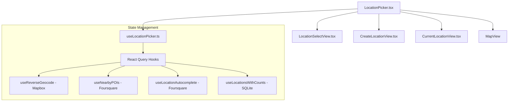
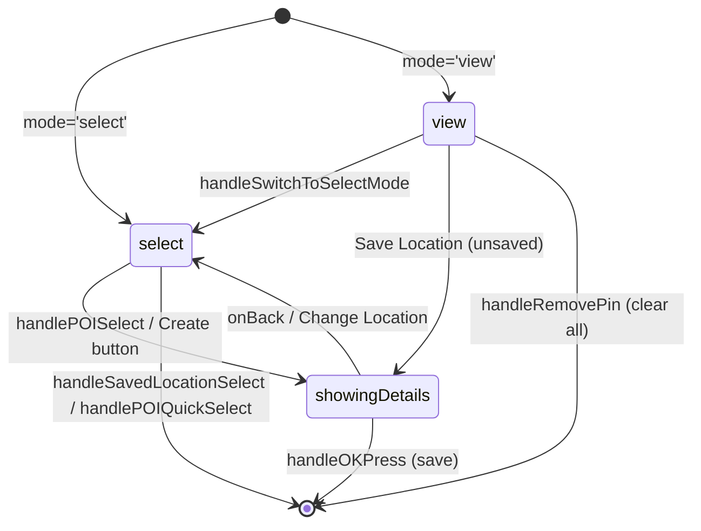
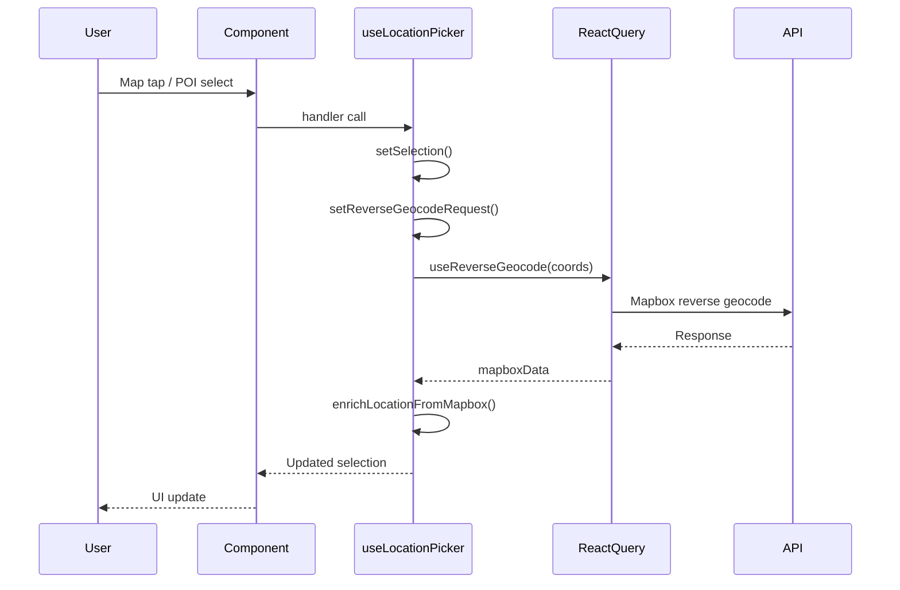
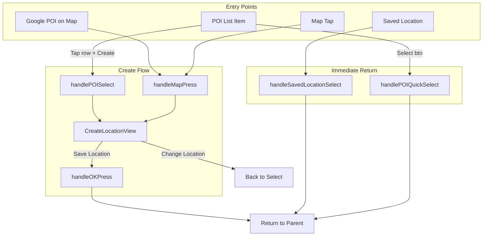

# LocationPicker Component

Modal for selecting, creating, or viewing locations with map, search, and saved places integration.

## Component Hierarchy



```
LocationPicker.tsx              # Main orchestrator (modal, map, routing)
├── hooks/
│   └── useLocationPicker.ts    # All state & business logic
└── components/
    ├── LocationSelectView.tsx  # Search + Nearby/Saved list
    ├── CreateLocationView.tsx  # Name input + precision + save
    └── CurrentLocationView.tsx # View/edit existing location
```

## Props Interface

```typescript
interface LocationPickerProps {
  visible: boolean;
  onClose: () => void;
  onSelect: (location: LocationType | null) => void;
  initialLocation?: LocationType | null;
  mode?: LocationPickerMode;  // 'select' | 'view'
  /** @deprecated Use mode='view' instead */
  readOnly?: boolean;
}
```

## Mode System



| Mode | View | Purpose |
|------|------|---------|
| `select` | LocationSelectView | Browse/search, pick location |
| `select` + `showingDetails` | CreateLocationView | Name and save location |
| `view` | CurrentLocationView | Display existing, edit/change/clear |

**Mode Override**: `effectiveMode` allows switching from `view` to `select` via `handleSwitchToSelectMode()`.

## State Architecture

### Core Types (LocationPickerTypes.ts)

```typescript
type LocationPickerMode = 'select' | 'create' | 'view';

interface LocationSelection {
  type: 'none' | 'poi' | 'map_tap' | 'existing';
  location: Location | null;
  tempCoordinates?: { latitude: number; longitude: number } | null;
  isLoadingDetails: boolean;
  locationId?: string;      // Links to saved location
  entryCount?: number;      // Entries using this location
}

interface LocationPickerUI {
  showingDetails: boolean;
  searchQuery: string;
  editableNameInput: string;
  editableAddressInput: string;
  editableCityInput: string;
  editableRegionInput: string;
  editableCountryInput: string;
  editableNeighborhoodInput: string;
  editablePostalCodeInput: string;
  isAddressEditing: boolean;
  quickSelectMode?: boolean;
}

interface MapState {
  region: { latitude, longitude, latitudeDelta, longitudeDelta } | undefined;
  markerPosition: { latitude, longitude } | undefined;
}
```

### Selection Factory Functions

```typescript
createEmptySelection()                    // type: 'none'
createSelectionFromLocation(location)     // type: 'existing'
createSelectionFromPOI(poi)               // type: 'poi', isLoadingDetails: true
createSelectionFromMapTap(lat, lng, radius?) // type: 'map_tap', isLoadingDetails: true
```

## Data Flow



### API Integrations
- **Mapbox** - Reverse geocoding (`useReverseGeocode`)
- **Foursquare** - Nearby POIs (`useNearbyPOIs`), search (`useLocationAutocomplete`)
- **SQLite** - Saved locations (`useLocationsWithCounts`)

## Handler Reference

### Selection Handlers

| Handler | Action | Closes Modal |
|---------|--------|--------------|
| `handleMapPress` | Move marker, clear preview, trigger geocode, clear radius | No |
| `handlePOISelect` | Go to CreateLocationView with POI data | No |
| `handlePOIQuickSelect` | Save POI to Location table, return immediately | Yes |
| `handleSavedLocationSelect` | Return saved location immediately | Yes |
| `handleGooglePOIClick` | Handle Google Maps POI tap, trigger geocode | No |

### Create/Save Handlers

| Handler | Action | Closes Modal |
|---------|--------|--------------|
| `handleOKPress` | Save with name to My Places (if toggle on), return location | Yes |
| `handleSwitchToSelectMode` | View -> Select, clear location name | No |

### Edit Handlers (View Mode)

| Handler | Action | Closes Modal |
|---------|--------|--------------|
| `handleEditLocation` | Update location name/address/radius in database | No |
| `handleRemoveLocation` | Unlink from saved (keep geo data as dropped pin) | Yes |
| `handleRemovePin` | Clear all location data | Yes |
| `handleClearAddress` | Enter address editing mode | No |
| `handleResetToOriginal` | Exit editing mode, restore geocoded values | No |
| `handleLookupAddress` | Re-trigger reverse geocoding | No |

### Map Handlers

| Handler | Action |
|---------|--------|
| `handleRegionChangeComplete` | Update mapState.region on pan/zoom |
| `handleCenterOnMyLocation` | GPS-based: view=fit both, create=recenter, select=zoom to GPS |

## Selection Flow



## Map Elements

| Element | When Shown | Color |
|---------|------------|-------|
| Blue marker | Selected point (hidden when precision circle shown) | `accent` |
| Red marker | Preview when list item clicked | `accentSecondary` |
| Precision circle | When `radius > 0` | `accent` (35% fill) |
| Preview circle | When previewing saved location with `locationRadius` | `accentSecondary` (35% fill) |
| Search radius (dashed) | When search query >= 2 chars | Yellow (#FFCC00), 50km |

### Area Marker Positioning
When `radius > 0`, the marker sits at the top of the precision circle, pointing down into the area:
```typescript
latitude: markerPosition.latitude + (radius / 111000)  // 1 degree ≈ 111km
```

## Keyboard Behavior

- Map animates to 0px height when keyboard visible
- Map button in header dismisses keyboard
- Compact mode: smaller list items, hidden Select buttons
- Auto-scroll to selected item after keyboard dismisses

## LocationSelectView

### Props Interface

```typescript
interface LocationSelectViewProps {
  ui: LocationPickerUI;
  setUI: React.Dispatch<React.SetStateAction<LocationPickerUI>>;
  activeListTab: 'nearby' | 'saved';
  setActiveListTab: React.Dispatch<React.SetStateAction<'nearby' | 'saved'>>;
  selection: LocationSelection;
  setSelection: React.Dispatch<React.SetStateAction<LocationSelection>>;
  mapState: MapState;
  mapRef: React.RefObject<MapView | null>;
  isOffline?: boolean;
  isLoadingSavedLocations: boolean;
  savedLocations: Array<LocationEntity & { distance: number; entry_count: number }>;
  allSavedLocations: Array<LocationEntity & { entry_count: number }>;
  displayedPOIs: POIItem[] | undefined;
  displayedLoading: boolean;
  tappedGooglePOI: TappedGooglePOI | null;
  previewMarker: PreviewMarker | null;
  setPreviewMarker: React.Dispatch<React.SetStateAction<PreviewMarker | null>>;
  selectedListItemId: string | null;
  setSelectedListItemId: React.Dispatch<React.SetStateAction<string | null>>;
  isSelectedLocationHighlighted: boolean;
  setIsSelectedLocationHighlighted: React.Dispatch<React.SetStateAction<boolean>>;
  setReverseGeocodeRequest: React.Dispatch<React.SetStateAction<Coords | null>>;
  handlePOISelect: (poi: POIItem) => void;
  handlePOIQuickSelect: (poi: POIItem) => Promise<void>;
  handleSavedLocationSelect: (location: LocationEntity & { distance: number }) => void;
  keyboardHeight?: number;
}
```

### Merged List Logic
- Combines Nearby POIs + Saved Locations
- Deduplicates by name+address match or name+proximity (<91m)
- Filters Google POI duplicates from Foursquare results
- Sorts by distance from marker

### Tab States
- **Nearby** (default) - POIs + nearby saved locations (within 10 miles)
- **Saved** (star toggle) - Saved locations only, searchable by name/city/address

### Item Selection
- **Tap row**: Zoom to location, show preview marker (3-click cycle: street/city/state)
- **Select button**: Quick-select saved/POI immediately (visible when item selected)

### 3-Click Zoom Pattern
```typescript
const deltas = {
  street: 0.005,  // ~500m view
  city: 0.05,     // ~5km view
  state: 2.0,     // ~200km view
};
```

## CreateLocationView

### Props Interface

```typescript
interface CreateLocationViewProps {
  selection: LocationSelection;
  setSelection: React.Dispatch<React.SetStateAction<LocationSelection>>;
  ui: LocationPickerUI;
  setUI: React.Dispatch<React.SetStateAction<LocationPickerUI>>;
  mapRef?: React.RefObject<MapView | null>;
  saveToMyPlaces: boolean;
  onSaveToMyPlacesChange: (value: boolean) => void;
  handleOKPress: () => void;
  onBack: () => void;
  onClearAddress?: () => void;
  onResetToOriginal?: () => void;
  radius: number;
  onRadiusChange: (radiusMeters: number) => void;
  keyboardHeight?: number;
}
```

### Features
- Name input (required for Save Location button)
- Address display with Edit mode (street address only editable)
- Precision picker (slider 0-5000m via modal)
- "Save to My Places" toggle (defaults to true)
- "Change Location" returns to select mode

## CurrentLocationView

### Props Interface

```typescript
interface CurrentLocationViewProps {
  selection: LocationSelection;
  setSelection: React.Dispatch<React.SetStateAction<LocationSelection>>;
  ui: LocationPickerUI;
  setUI: React.Dispatch<React.SetStateAction<LocationPickerUI>>;
  mapRef?: React.RefObject<MapView | null>;
  handleSwitchToSelectMode: () => void;
  handleRemoveLocation: () => void;
  handleRemovePin: () => void;
  handleEditLocation?: (newName: string, newAddress?: string | null, newLocationRadius?: number | null) => void;
  onResetToOriginal?: () => void;
  radius: number;
  onRadiusChange: (radiusMeters: number) => void;
  keyboardHeight?: number;
}
```

### Display Mode
- Location card with zoom cycling (tap to cycle city/street/state)
- Icon states: crosshairs (dropped pin), pin+dot (POI), pin+star (saved)
- Entry count badge

### Actions
- **Edit Location** - Saved locations only, inline editing
- **Save Location** - Unsaved, goes to CreateLocationView
- **Change Location** - Switch to select mode
- **Clear Location** - Remove all location data (with confirmation)

### Edit Mode
- Name input with clear button
- Address editing (street only, other fields read-only)
- Precision slider via modal
- Entry count warning for multi-entry updates

## Precision System

| Radius | Decimals | Description |
|--------|----------|-------------|
| 0 | 6 | Exact |
| <= 10m | 4 | Building level |
| <= 100m | 3 | Block level |
| <= 500m | 2 | Neighborhood |
| <= 1000m | 2 | District |
| > 1000m | 2 | Area level |

### Coordinate Rounding

```typescript
function getDecimalsForRadius(radiusMeters: number): number {
  if (radiusMeters === 0) return 6;
  if (radiusMeters <= 10) return 4;
  if (radiusMeters <= 100) return 3;
  return 2;
}
```

## Hook Return Object

```typescript
{
  // Mode
  effectiveMode: LocationPickerMode,
  setModeOverride: (mode: LocationPickerMode | null) => void,

  // Offline status
  isOffline: boolean,

  // Selection
  selection: LocationSelection,
  setSelection: Dispatch<SetStateAction<LocationSelection>>,

  // UI State
  ui: LocationPickerUI,
  setUI: Dispatch<SetStateAction<LocationPickerUI>>,
  activeListTab: 'nearby' | 'saved',
  setActiveListTab: Dispatch<SetStateAction<'nearby' | 'saved'>>,

  // Save toggle
  saveToMyPlaces: boolean,
  setSaveToMyPlaces: Dispatch<SetStateAction<boolean>>,

  // Map State
  mapState: MapState,
  setMapState: Dispatch<SetStateAction<MapState>>,
  mapRef: RefObject<MapView>,
  blueMarkerRef: RefObject<any>,
  redMarkerRef: RefObject<any>,

  // Loading States
  isLoadingLocation: boolean,
  isLoadingSavedLocations: boolean,

  // Locations
  savedLocations: Array<LocationEntity & { distance: number; entry_count: number }>,
  allSavedLocations: Array<LocationEntity & { entry_count: number }>,
  displayedPOIs: POIItem[] | undefined,
  displayedLoading: boolean,

  // Google POI
  tappedGooglePOI: TappedGooglePOI | null,
  setTappedGooglePOI: Dispatch<SetStateAction<TappedGooglePOI | null>>,

  // Preview Marker
  previewMarker: PreviewMarker | null,
  setPreviewMarker: Dispatch<SetStateAction<PreviewMarker | null>>,

  // Selected List Item
  selectedListItemId: string | null,
  setSelectedListItemId: Dispatch<SetStateAction<string | null>>,

  // Selected Location Highlight
  isSelectedLocationHighlighted: boolean,
  setIsSelectedLocationHighlighted: Dispatch<SetStateAction<boolean>>,

  // Location radius
  radius: number,
  setRadius: Dispatch<SetStateAction<number>>,

  // Reverse Geocode
  setReverseGeocodeRequest: Dispatch<SetStateAction<Coords | null>>,

  // Handlers
  handleSavedLocationSelect: (location: LocationEntity & { distance: number }) => void,
  handlePOISelect: (poi: POIItem) => void,
  handlePOIQuickSelect: (poi: POIItem) => Promise<void>,
  handleGooglePOIClick: (event: any) => void,
  handleRegionChangeComplete: (region: any) => void,
  handleMapPress: (event: any) => void,
  handleOKPress: () => Promise<void>,
  handleClearAddress: () => void,
  handleResetToOriginal: () => void,
  handleLookupAddress: () => void,
  handleCenterOnMyLocation: () => Promise<void>,
  handleSwitchToSelectMode: () => void,
  handleRemoveLocation: () => void,
  handleRemovePin: () => void,
  handleEditLocation: (newName: string, newAddress?: string | null, newLocationRadius?: number | null) => Promise<void>,

  // Helpers
  calculateSearchRadius: (region: MapState['region']) => number,
}
```

## Offline Behavior

When `isOffline` is true:
- Skip Mapbox/Foursquare API calls
- Show "Offline - Showing saved locations only" banner
- Only SQLite saved locations are displayed
- Coordinates shown instead of "Loading address..."
