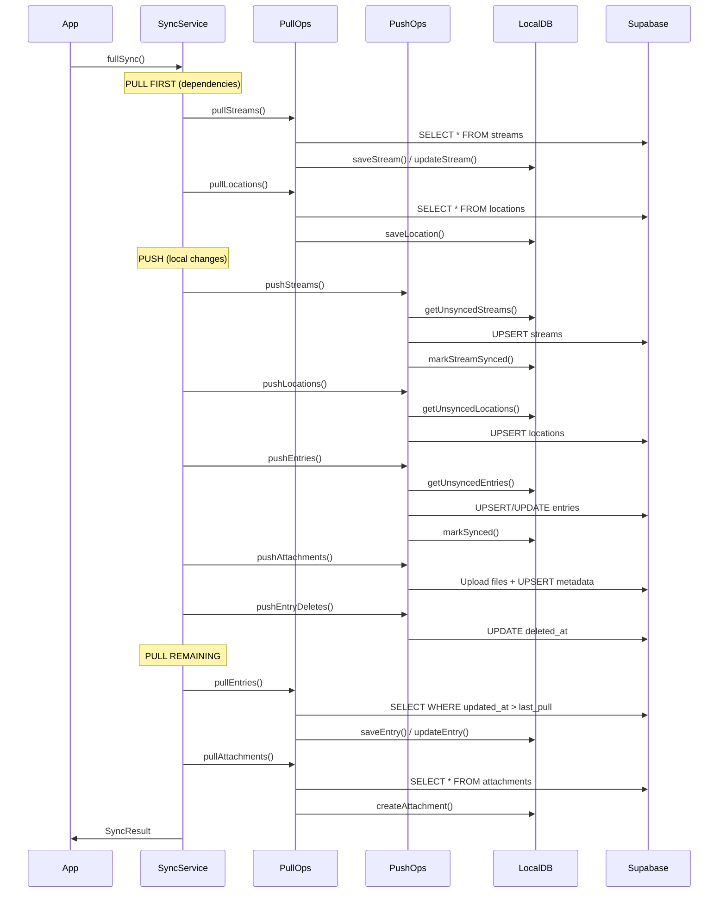
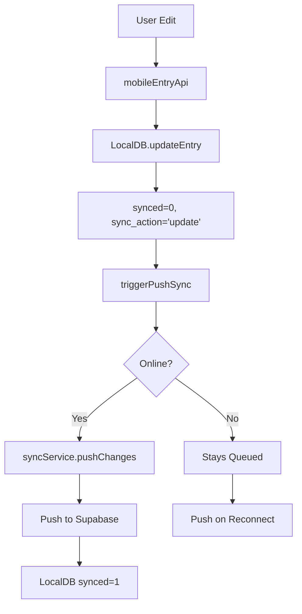
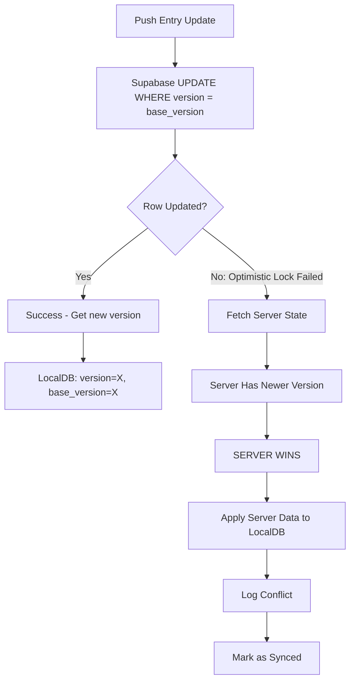
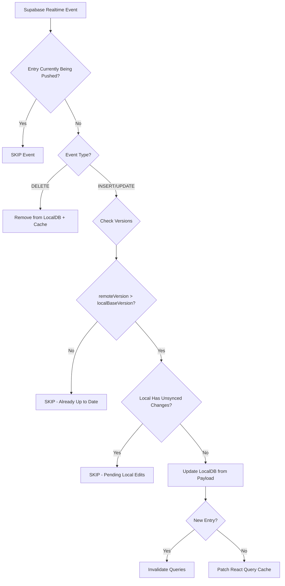

# Sync Architecture

## Overview

Mobile sync uses LocalDB (SQLite) as the source of truth. Supabase is the remote server for cross-device sync.

**Core Principles:**
- LocalDB-first: All reads/writes go through LocalDB
- Offline-first: App works 100% without network
- UI is sync-agnostic: Components never call Supabase directly
- Supabase is optional: Sync happens invisibly in background

---

## File Structure

```
apps/mobile/src/shared/sync/
  index.ts              - Public exports
  syncApi.ts            - Public API wrapper (for other modules)
  syncHooks.ts          - React hooks (useSync, useSyncStatus)
  syncService.ts        - Core sync orchestration (singleton class)
  syncTypes.ts          - TypeScript types
  pushSyncOperations.ts - Push logic (Local -> Server)
  pullSyncOperations.ts - Pull logic (Server -> Local)

apps/mobile/src/shared/db/
  localDB.ts            - SQLite database operations
  dbDebug.ts            - Debug utilities
```

---

## Data Flow Diagrams

### Full Sync Flow



### Write Flow (User Edit)



### Conflict Resolution Flow



### Realtime Event Flow



---

## Sync Order (Foreign Key Dependencies)

**Push:** Streams -> Locations -> Entries -> Attachments -> Entry Deletes

**Pull (Initial):** Streams -> Locations -> (then push) -> Entries -> Attachments

The order ensures:
1. Streams exist before entries reference them
2. Locations exist before entries reference them
3. Entries exist before attachments reference them
4. Deletes happen last to avoid orphaning references

---

## Version Tracking

| Field | Description | Updated When |
|-------|-------------|--------------|
| `version` | Server version number | Incremented by Supabase trigger on each write |
| `base_version` | Server version this edit is based on | Set to server version after successful sync |
| `synced` | 0 = needs sync, 1 = synced | Set to 0 on local edit, 1 after push |
| `sync_action` | 'create' \| 'update' \| 'delete' \| null | Set on local edit, cleared after sync |

**Conflict Detection:** `serverVersion > base_version` indicates server has changes we don't have locally.

---

## Conflict Resolution

**Strategy: Optimistic Locking with Server Wins**

### Push Update Logic (pushSyncOperations.ts:syncEntry)

```typescript
// Conditional UPDATE - only succeeds if version matches
const { data } = await supabase
  .from('entries')
  .update(entryData)
  .eq('entry_id', entry.entry_id)
  .eq('version', localBaseVersion)  // Optimistic lock
  .select('version')
  .maybeSingle();

if (!data) {
  // LOCK FAILED - Server has newer version
  // Fetch server state and accept it
  const serverEntry = await fetchServerEntry(entry.entry_id);
  await localDB.updateEntry(entry.entry_id, {
    ...serverEntry,
    version: serverEntry.version,
    base_version: serverEntry.version,
    synced: 1,
    sync_action: null,
  });
}
```

### Key Behaviors:
1. Push uses `UPDATE WHERE version = base_version` (optimistic lock)
2. If update returns no rows, version mismatch occurred
3. Fetch current server state
4. Apply server version to LocalDB (server wins)
5. Log conflict, mark as synced

---

## Public API

### syncApi.ts Functions

| Function | Signature | Description |
|----------|-----------|-------------|
| `initializeSync` | `(queryClient?: QueryClient) => Promise<void>` | Initialize on app startup |
| `destroySync` | `() => void` | Cleanup on logout/unmount |
| `triggerPushSync` | `() => void` | Fire-and-forget after local writes |
| `triggerPullSync` | `() => Promise<SyncResult>` | Blocking pull for critical reads |
| `refreshEntryFromServer` | `(entryId: string) => Promise<boolean>` | Pull single entry before editing |
| `fullSync` | `() => Promise<SyncResult>` | Push + Pull all |
| `forcePull` | `() => Promise<SyncResult>` | Full pull ignoring timestamps |
| `getSyncStatus` | `() => Promise<SyncStatus>` | Get current sync state |

### syncHooks.ts Hooks

| Hook | Returns | Description |
|------|---------|-------------|
| `useSync()` | `{ sync, forcePull, unsyncedCount, isSyncing, lastSyncTime, syncState, forcePullState }` | Full sync control |
| `useSyncStatus()` | `{ unsyncedCount, isSyncing, lastSyncTime, isLoading }` | Lightweight status display |

---

## Push Operations (pushSyncOperations.ts)

### pushStreams
```typescript
pushStreams(): Promise<{ success: number; errors: number }>
```
- Gets unsynced streams from LocalDB
- Skips `is_localonly` streams (marks synced immediately)
- Upserts to Supabase with `onConflict: 'stream_id'`
- Converts SQLite integers (0/1) to booleans
- Converts JSON strings to arrays for Postgres TEXT[]

### pushLocations
```typescript
pushLocations(): Promise<{ success: number; errors: number }>
```
- Gets unsynced locations from LocalDB
- Upserts to Supabase
- For deletes, sets `deleted_at` (soft delete)

### pushEntries
```typescript
pushEntries(
  localOnlyStreamIds: Set<string>,
  markPushing: (id: string) => void,
  unmarkPushing: (id: string) => void
): Promise<{ success: number; errors: number }>
```
- Filters out entries with `sync_action === 'delete'`
- Skips entries in local-only streams
- Tracks currently-pushing entries to prevent realtime race conditions
- For creates: uses UPSERT with `onConflict: 'entry_id'`
- For updates: uses optimistic locking (see conflict resolution)
- Validates/sanitizes status values before push

### pushEntryDeletes
```typescript
pushEntryDeletes(
  localOnlyStreamIds: Set<string>,
  markPushing: (id: string) => void,
  unmarkPushing: (id: string) => void
): Promise<{ success: number; errors: number }>
```
- Handles `sync_action === 'delete'` entries
- Sets `deleted_at` on server (soft delete)
- Clears `location_id` to avoid orphan references

### pushAttachments
```typescript
pushAttachments(localOnlyStreamIds: Set<string>): Promise<{ success: number; errors: number }>
```
Three phases:
1. **Upload files**: `uploadAttachmentToSupabase()` for `uploaded=false` attachments
2. **Sync metadata**: UPSERT to attachments table
3. **Delete**: Remove from storage + database for `sync_action='delete'`

---

## Pull Operations (pullSyncOperations.ts)

### pullStreams
```typescript
pullStreams(forceFullPull: boolean): Promise<{ new: number; updated: number; deleted: number }>
```
- Fetches all user streams from Supabase
- Compares all stream fields to detect changes
- Skips update if local has unsynced changes (`synced === 0`)
- Detects streams missing from server and marks for re-push

### pullLocations
```typescript
pullLocations(forceFullPull: boolean): Promise<{ new: number; updated: number }>
```
- Fetches locations where `deleted_at IS NULL`
- Compares key fields (name, latitude, longitude, address, city)
- Skips update if local has unsynced changes

### pullEntries
```typescript
pullEntries(
  forceFullPull: boolean,
  pullStartTime: Date,
  getLastTimestamp: () => Promise<Date | null>
): Promise<{ new: number; updated: number; deleted: number }>
```
- Incremental sync using `updated_at > last_pull_timestamp`
- Forces full pull if LocalDB is empty
- Handles soft deletes: if `deleted_at` set, removes from LocalDB
- Uses version comparison: `remoteVersion > localBaseVersion`
- Skips entries with unsynced local changes

### pullAttachments
```typescript
pullAttachments(forceFullPull: boolean): Promise<{ new: number; updated: number; deleted: number }>
```
- Fetches all user attachments
- Preserves `local_path` from existing local attachment
- Detects server-deleted attachments and removes locally
- Deletes local file when attachment removed

### Timestamp Management
```typescript
getLastPullTimestamp(): Promise<Date | null>
saveLastPullTimestamp(timestamp: Date): Promise<void>
```
- Stored in `sync_metadata` table with key `'last_pull_timestamp'`
- Used for incremental entry pulls

---

## Sync Triggers

| Event | Action | Function |
|-------|--------|----------|
| After LocalDB write | Push changes | `triggerPushSync()` (non-blocking) |
| App foreground | Full sync (if >30s since last) | `fullSync('app-foreground')` |
| Network reconnect | Full sync after 1s delay | `handleReconnect()` |
| Realtime event | Update LocalDB + patch cache | `processEntryRealtimeEvent()` |
| Initial app start | Full sync | `initialize()` |

---

## Local-Only Streams

When `stream.is_localonly = 1`:
- Stream marked synced immediately (skipped in push)
- Entries in this stream marked synced immediately
- Attachments from these entries marked synced
- Data stays only on device, never touches Supabase

---

## Realtime Subscription

### Setup (syncService.ts)
```typescript
supabase
  .channel('db-changes')
  .on('postgres_changes', { event: '*', schema: 'public', table: 'entries' }, ...)
  .on('postgres_changes', { event: '*', schema: 'public', table: 'streams' }, ...)
  .on('postgres_changes', { event: '*', schema: 'public', table: 'attachments' }, ...)
  .on('postgres_changes', { event: '*', schema: 'public', table: 'locations' }, ...)
  .subscribe()
```

### Entry Event Processing
1. Skip if entry is currently being pushed (`currentlyPushingEntryIds.has(entryId)`)
2. For DELETE: remove from LocalDB and React Query cache
3. For INSERT/UPDATE:
   - Check `remoteVersion <= localBaseVersion` -> skip (already up to date)
   - Check `localEntry.synced === 0` -> skip (pending local changes)
   - Update LocalDB from payload
   - For new entries: invalidate queries
   - For updates: patch cache with `setQueryData`

### Reconnection
- Exponential backoff: starts at 1s, max 30s
- Checks network state before reconnecting
- On CHANNEL_ERROR/TIMED_OUT: schedule reconnect
- On network reconnect: reset backoff, immediate reconnect attempt

### Debouncing
- Attachments and locations use 2s debounce timer
- Batches multiple rapid events into single pull

---

## Race Condition Prevention

### Currently Pushing Set
```typescript
private currentlyPushingEntryIds: Set<string> = new Set();
```

When pushing an entry:
1. Add to set before push: `markPushing(entry.entry_id)`
2. Push to Supabase
3. Remove from set in finally block: `unmarkPushing(entry.entry_id)`

Realtime events for entries in this set are skipped to prevent:
- Overwriting local changes with stale server data
- Duplicate updates from our own push

---

## Error Handling

### Sync Errors
- Individual item failures don't stop sync
- Error count tracked in `SyncResult.errors`
- Errors logged to `sync_logs` table
- Failed items remain with `synced=0` for retry

### Recording Errors
```typescript
await localDB.recordSyncError(entryId, errorMessage);
await localDB.recordStreamSyncError(streamId, errorMessage);
await localDB.recordLocationSyncError(locationId, errorMessage);
```

### Network Handling
- Uses `@react-native-community/netinfo`
- Checks `isConnected && isInternetReachable` before sync
- Tracks `wasOffline` state for reconnect detection
- 1s delay after reconnect before syncing (network stabilization)

---

## Cache Invalidation

### After Pull (syncService.ts:invalidateQueryCache)
```typescript
queryClient.invalidateQueries({ queryKey: ['entries'] });
queryClient.invalidateQueries({ queryKey: ['streams'] });
queryClient.invalidateQueries({ queryKey: ['locations'] });
queryClient.invalidateQueries({ queryKey: ['unsyncedCount'] });
queryClient.invalidateQueries({ queryKey: ['entryCounts'] });
queryClient.invalidateQueries({ queryKey: ['tags'] });
queryClient.invalidateQueries({ queryKey: ['mentions'] });
```

### After Realtime Entry Update
- For new entries: invalidate `['entries']` and `['entryCounts']`
- For updates: patch specific entry with `setQueryData`
- For deletes: remove from cache + invalidate counts

---

## LocalDB Sync Methods

### Entry Sync
| Method | Description |
|--------|-------------|
| `getUnsyncedEntries()` | Returns entries where `synced=0 AND local_only=0` |
| `markSynced(entryId)` | Sets `synced=1, sync_action=null`; deletes if `sync_action='delete'` |
| `getUnsyncedCount()` | Count of unsynced non-local-only entries |
| `recordSyncError(entryId, message)` | Stores error in `sync_error` field |

### Stream Sync
| Method | Description |
|--------|-------------|
| `getUnsyncedStreams()` | Returns streams where `synced=0` |
| `markStreamSynced(streamId)` | Sets `synced=1, sync_action=null`; deletes if `sync_action='delete'` |
| `recordStreamSyncError(streamId, message)` | Stores error |

### Location Sync
| Method | Description |
|--------|-------------|
| `getUnsyncedLocations()` | Returns locations where `synced=0` |
| `markLocationSynced(locationId)` | Sets `synced=1, sync_action=null`; deletes if `sync_action='delete'` |
| `recordLocationSyncError(locationId, message)` | Stores error |

### Attachment Sync
| Method | Description |
|--------|-------------|
| `getAttachmentsNeedingUpload()` | Attachments with local_path and `uploaded=false` |
| `getAttachmentsNeedingSync()` | Attachments where `synced=0 AND sync_action IS NOT NULL` |
| `permanentlyDeleteAttachment(id)` | Hard delete from SQLite |

---

## Types

```typescript
interface SyncResult {
  success: boolean;
  pushed: { entries: number; streams: number; locations: number; attachments: number };
  pulled: { entries: number; streams: number; locations: number; attachments: number };
  errors: { entries: number; streams: number; locations: number; attachments: number };
  duration: number;
}

interface SyncStatus {
  unsyncedCount: number;
  isSyncing: boolean;
  lastSyncTime: number | null;
}

type SyncTrigger = 'manual' | 'post-save' | 'realtime' | 'app-foreground' | 'initialization';

interface PushResult {
  success: number;
  errors: number;
}

interface PullResult {
  new: number;
  updated: number;
  deleted?: number;
}
```

---

## Configuration Constants

| Constant | Value | Location |
|----------|-------|----------|
| `MIN_FOREGROUND_SYNC_INTERVAL_MS` | 30000 (30s) | syncService.ts |
| `REALTIME_MAX_BACKOFF_MS` | 30000 (30s) | syncService.ts |
| Realtime debounce | 2000 (2s) | syncService.ts |
| Network stabilization delay | 1000 (1s) | syncService.ts |
| Sync status poll interval | 5000 (5s) | syncHooks.ts |

---

## Attachments

### Push Flow
1. **Upload phase**: Upload file to Supabase Storage
   - `uploadAttachmentToSupabase(localPath, storagePath)`
   - Mark `uploaded=true` in LocalDB
2. **Metadata phase**: Upsert to attachments table
   - Includes: attachment_id, entry_id, user_id, file_path, mime_type, file_size, dimensions, position
   - Mark `synced=1, sync_action=null`
3. **Delete phase**: For `sync_action='delete'`
   - Delete from database
   - Delete from storage
   - `permanentlyDeleteAttachment()` in LocalDB

### Pull Flow
1. Fetch all user attachments from Supabase
2. Save to LocalDB with `uploaded=true, synced=1`
3. Preserve existing `local_path` if attachment already exists locally
4. Detect server-deleted attachments (not in remote set)
5. Delete local file and database record for removed attachments
6. Background download: `downloadAttachmentsInBackground(10)` runs 1s after sync

---

## Data Cleanup

### Wrong User Data Cleanup (on init)
```typescript
async cleanupWrongUserData(): Promise<void>
```
- Checks if any entries exist with different `user_id`
- If found, calls `localDB.clearAllData()`
- Prevents data leakage between user sessions

### Sync Log
```typescript
await localDB.addSyncLog(level, source, message, details?);
```
- Levels: 'info', 'warning', 'error'
- Used for debugging sync issues
