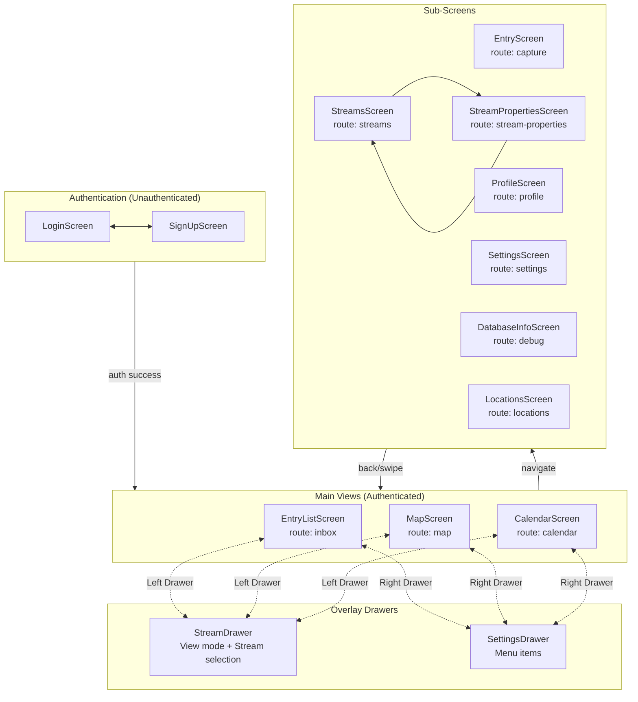
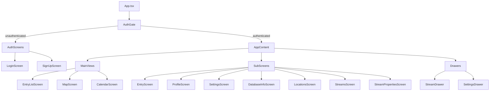

# Trace Mobile App - Navigation Sitemap

This document provides a comprehensive map of all screens, navigation flows, and data dependencies in the Trace mobile app. It is designed for AI consumption and development reference.

## Navigation Architecture

Trace uses a custom navigation system (not React Navigation) implemented via:
- **NavigationContext** - Provides `navigate(screen, params?)` function
- **DrawerContext** - Manages view mode (list/map/calendar) and stream selection
- **App.tsx** - Central routing logic via `handleNavigate` and screen rendering

### Key Concepts

1. **Main View Screens** (`inbox`, `map`, `calendar`) - Stay mounted for instant switching
2. **Sub-Screens** - Mount/unmount as needed, back always returns to last main view
3. **Swipe-back gesture** - iOS-style gesture returns to main view from any sub-screen
4. **Drawers** - Left drawer for stream selection, right drawer for settings access

---

## Navigation Flow Diagram



---

## Screen Hierarchy



---

## Screen Reference

### Authentication Screens

#### LoginScreen
| Property | Value |
|----------|-------|
| **Route** | N/A (controlled by `showSignUp` state in AuthGate) |
| **File** | `apps/mobile/src/modules/auth/screens/LoginScreen.tsx` |
| **Props** | `onSwitchToSignUp: () => void` |
| **Hooks** | `useAuth` |
| **Description** | Email/password login with Google OAuth option |

#### SignUpScreen
| Property | Value |
|----------|-------|
| **Route** | N/A (controlled by `showSignUp` state in AuthGate) |
| **File** | `apps/mobile/src/modules/auth/screens/SignUpScreen.tsx` |
| **Props** | `onSwitchToLogin: () => void` |
| **Hooks** | `useAuth` |
| **Description** | New user registration with email confirmation |

---

### Main View Screens

These screens stay mounted for instant switching via the left drawer.

#### EntryListScreen
| Property | Value |
|----------|-------|
| **Route** | `inbox` |
| **File** | `apps/mobile/src/screens/EntryListScreen.tsx` |
| **Props** | None |
| **Hooks** | `useNavigation`, `useTheme`, `useAuth`, `useStreams`, `useEntries`, `useLocations`, `useDrawer`, `useSettings`, `useSettingsDrawer`, `useNavigationMenu` |
| **Description** | Default view showing entries as cards/list. Supports filtering by stream, search, sort modes, and display modes. |
| **Navigates To** | `capture` (entry creation/editing) |
| **Features** | FAB for new entry, swipe actions, stream picker modal |

#### MapScreen
| Property | Value |
|----------|-------|
| **Route** | `map` |
| **File** | `apps/mobile/src/screens/MapScreen.tsx` |
| **Props** | `isVisible?: boolean` (default: true) |
| **Hooks** | `useNavigation`, `useTheme`, `useDrawer`, `useNavigationMenu`, `useSettings`, `useStreams`, `useEntries`, `useLocations` |
| **Description** | Geographic view showing entries with GPS coordinates on a map with clustering |
| **Navigates To** | `capture` (entry editing) |
| **Features** | Cluster markers, fit-all button, current location button, entry list below map |

#### CalendarScreen
| Property | Value |
|----------|-------|
| **Route** | `calendar` |
| **File** | `apps/mobile/src/screens/CalendarScreen.tsx` |
| **Props** | None |
| **Hooks** | `useNavigation`, `useTheme`, `useDrawer`, `useNavigationMenu`, `useEntries`, `useStreams`, `usePersistedState` |
| **Description** | Date-based view with day/month/year zoom levels |
| **Navigates To** | `capture` (entry creation with date), `inbox` (filtered by tag/mention) |
| **Features** | Three zoom levels, date field selector (entry_date, updated_at, due_date), FAB for new entry |

---

### Sub-Screens

Sub-screens mount on demand. Back navigation (hardware button or swipe) returns to the last main view.

#### EntryScreen
| Property | Value |
|----------|-------|
| **Route** | `capture` |
| **File** | `apps/mobile/src/modules/entries/components/EntryScreen.tsx` |
| **Props** | See below |
| **Hooks** | `useNavigation`, `useTheme`, `useEntries`, `useStreams`, `useLocations`, various custom hooks |
| **Description** | View/edit single entry with rich editor, attachments, location, ratings, etc. |
| **Navigates To** | Back to previous main view |

**EntryScreen Props:**
```typescript
interface EntryScreenProps {
  entryId?: string;           // Edit mode: existing entry ID
  initialStreamId?: string | null;  // Pre-select stream for new entry
  initialStreamName?: string; // Display name for pre-selected stream
  initialContent?: string;    // Pre-fill content (e.g., #tag or @mention)
  initialDate?: string;       // Pre-fill entry date (from calendar)
}
```

#### ProfileScreen
| Property | Value |
|----------|-------|
| **Route** | `profile` |
| **File** | `apps/mobile/src/screens/ProfileScreen.tsx` |
| **Props** | None |
| **Hooks** | `useNavigation`, `useTheme`, `useAuth` |
| **Description** | User profile settings, display name, avatar |

#### SettingsScreen
| Property | Value |
|----------|-------|
| **Route** | `settings` |
| **File** | `apps/mobile/src/screens/SettingsScreen.tsx` |
| **Props** | None |
| **Hooks** | `useSettings`, `useTheme` |
| **Description** | App settings including GPS capture, theme, font, units, image quality |
| **Contains Modals** | `UnitSystemSelector`, `ImageQualitySelector`, `ThemeSelector`, `FontSelector` |

#### DatabaseInfoScreen
| Property | Value |
|----------|-------|
| **Route** | `debug` |
| **File** | `apps/mobile/src/screens/DatabaseInfoScreen.tsx` |
| **Props** | None |
| **Hooks** | `useNavigation`, `useSync` |
| **Description** | Debug screen showing SQLite database contents, sync status, cloud comparison |
| **Features** | Tabbed interface (Status, Entries, Streams, Locations, Attachments, Logs), sync actions, cleanup tools |

#### LocationsScreen
| Property | Value |
|----------|-------|
| **Route** | `locations` |
| **File** | `apps/mobile/src/screens/LocationsScreen.tsx` |
| **Props** | None |
| **Hooks** | `useNavigation`, `useTheme`, `useLocationsWithCounts` |
| **Description** | Hierarchical location browser (country > region > city > neighborhood > place) |
| **Navigates To** | `inbox` with `returnStreamId: location:{id}` filter |

#### StreamsScreen
| Property | Value |
|----------|-------|
| **Route** | `streams` |
| **File** | `apps/mobile/src/screens/StreamsScreen.tsx` |
| **Props** | None |
| **Hooks** | `useNavigation`, `useTheme`, `useStreams` |
| **Description** | Manage streams list with search, create, delete |
| **Navigates To** | `stream-properties` (edit/create), `inbox` (filter by stream) |

#### StreamPropertiesScreen
| Property | Value |
|----------|-------|
| **Route** | `stream-properties` |
| **File** | `apps/mobile/src/screens/StreamPropertiesScreen.tsx` |
| **Props** | See below |
| **Hooks** | `useNavigation`, `useTheme`, `useStreams` |
| **Description** | Edit stream settings: name, features, templates, privacy |
| **Navigates To** | `streams` on save/back |

**StreamPropertiesScreen Props:**
```typescript
interface StreamPropertiesScreenProps {
  streamId: string | null;  // null = create mode, string = edit mode
}
```

**Contains Modal Components:**
- `StatusConfigModal` - Configure entry statuses for stream
- `TypeConfigModal` - Configure entry types for stream
- `RatingConfigModal` - Configure rating type (stars, numbers, etc.)
- `TemplateHelpModal` - Help for template variables
- `TemplateEditorModal` - Full-screen template editor

---

## Modal Components

These modals appear within screens but are not separate routes:

| Modal | Location | Purpose |
|-------|----------|---------|
| `StreamPicker` | EntryListScreen, MapScreen | Select stream for move operation |
| `DisplayModeSelector` | MapScreen, CalendarScreen | Choose entry display mode |
| `SortModeSelector` | MapScreen, CalendarScreen | Choose sort mode and order |
| `UnitSystemSelector` | SettingsScreen | Metric/Imperial selection |
| `ImageQualitySelector` | SettingsScreen | Photo compression level |
| `ThemeSelector` | SettingsScreen | App color scheme |
| `FontSelector` | SettingsScreen | App typeface |
| `StatusConfigModal` | StreamPropertiesScreen | Configure stream statuses |
| `TypeConfigModal` | StreamPropertiesScreen | Configure stream types |
| `RatingConfigModal` | StreamPropertiesScreen | Configure rating type |
| `TemplateHelpModal` | StreamPropertiesScreen | Template variable reference |
| `TemplateEditorModal` | StreamPropertiesScreen | Content template editor |
| `AddStreamModal` | StreamDrawer | Quick-create new stream |

---

## Route Reference Table

| Route | Screen | Description | Params |
|-------|--------|-------------|--------|
| `inbox` | EntryListScreen | Default entry list | `returnStreamId?`, `returnStreamName?` |
| `map` | MapScreen | Map view | None |
| `calendar` | CalendarScreen | Calendar view | None |
| `capture` | EntryScreen | Entry detail/edit | `entryId?`, `initialStreamId?`, `initialStreamName?`, `initialContent?`, `initialDate?` |
| `profile` | ProfileScreen | User profile | None |
| `settings` | SettingsScreen | App settings | None |
| `debug` | DatabaseInfoScreen | Debug info | None |
| `locations` | LocationsScreen | Location browser | None |
| `streams` | StreamsScreen | Stream management | None |
| `stream-properties` | StreamPropertiesScreen | Edit stream | `streamId` (null for create) |

---

## File Locations Summary

```
apps/mobile/
├── App.tsx                              # Main routing and screen rendering
├── src/
│   ├── modules/
│   │   ├── auth/
│   │   │   └── screens/
│   │   │       ├── LoginScreen.tsx
│   │   │       └── SignUpScreen.tsx
│   │   ├── entries/
│   │   │   └── components/
│   │   │       └── EntryScreen.tsx
│   │   └── streams/
│   │       └── components/
│   │           ├── StatusConfigModal.tsx
│   │           ├── TypeConfigModal.tsx
│   │           ├── RatingConfigModal.tsx
│   │           ├── TemplateHelpModal.tsx
│   │           ├── TemplateEditorModal.tsx
│   │           └── AddStreamModal.tsx
│   ├── screens/
│   │   ├── EntryListScreen.tsx
│   │   ├── MapScreen.tsx
│   │   ├── CalendarScreen.tsx
│   │   ├── ProfileScreen.tsx
│   │   ├── SettingsScreen.tsx
│   │   ├── DatabaseInfoScreen.tsx
│   │   ├── LocationsScreen.tsx
│   │   ├── StreamsScreen.tsx
│   │   └── StreamPropertiesScreen.tsx
│   ├── shared/
│   │   └── contexts/
│   │       ├── NavigationContext.tsx    # navigate() function provider
│   │       ├── DrawerContext.tsx        # View mode and stream selection
│   │       ├── SettingsDrawerContext.tsx
│   │       ├── AuthContext.tsx
│   │       ├── ThemeContext.tsx
│   │       └── SettingsContext.tsx
│   └── components/
│       └── drawer/
│           ├── StreamDrawer.tsx         # Left drawer
│           └── SettingsDrawer.tsx       # Right drawer
```

---

## Navigation Patterns

### Opening an Entry
```typescript
// From list/map/calendar to edit existing entry
navigate("capture", { entryId: "uuid-here" });

// Create new entry in specific stream
navigate("capture", {
  initialStreamId: "stream-uuid",
  initialStreamName: "Stream Name",
});

// Create new entry with pre-filled content (e.g., from tag filter)
navigate("capture", {
  initialContent: "#tagname ",
});

// Create new entry with specific date (from calendar)
navigate("capture", {
  initialDate: "2024-01-15",
});
```

### Filtering Entries
```typescript
// Filter by stream
navigate("inbox", {
  returnStreamId: "stream-uuid",
  returnStreamName: "Stream Name",
});

// Filter by tag
setSelectedStreamId("tag:tagname");
setSelectedStreamName("#tagname");

// Filter by mention
setSelectedStreamId("mention:personname");
setSelectedStreamName("@personname");

// Filter by location
navigate("inbox", {
  returnStreamId: "location:location-uuid",
  returnStreamName: "Location Name",
});
```

### Stream Management
```typescript
// Edit existing stream
navigate("stream-properties", { streamId: "stream-uuid" });

// Create new stream
navigate("stream-properties", { streamId: null });
```

---

## Context Dependencies

| Context | Primary Use | Screens Using It |
|---------|-------------|------------------|
| `NavigationContext` | `navigate()` function | All screens |
| `DrawerContext` | View mode, stream selection | Main views, EntryScreen |
| `AuthContext` | User auth state, sign out | LoginScreen, main views |
| `ThemeContext` | Colors, typography, shadows | All screens |
| `SettingsContext` | User preferences | SettingsScreen, main views |
| `SettingsDrawerContext` | Right drawer control | Main views |

---

## Data Flow

### Entry Data
```
useEntries(filter) → entries, isLoading, entryMutations
                   ↓
Filter Types:
- streamId: string | null (specific stream or unassigned)
- tag: string (filter by #tag)
- mention: string (filter by @mention)
- location: string (filter by location_id)
```

### Stream Data
```
useStreams() → streams, isLoading, streamMutations
            ↓
Used for: stream picker, entry metadata, filtering
```

### Location Data
```
useLocations() → locations data
useLocationsWithCounts() → locations with entry_count
                        ↓
Used for: LocationsScreen, entry location picker, map view
```
